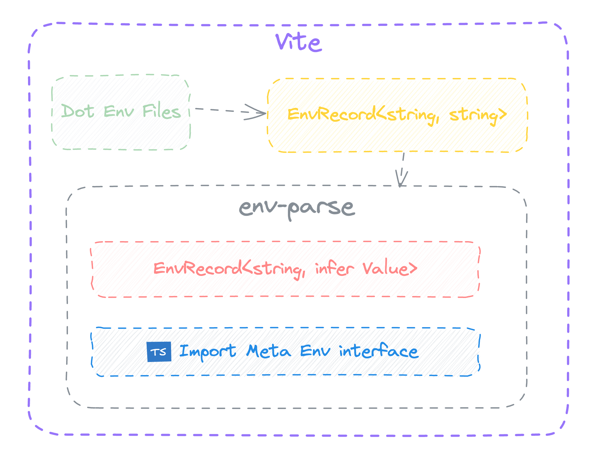

# vite-plugin-env-parse


[简体中文](./README.zh.md)

将 env 字符串值解析为正确的值，而不是所有值都是字符串。并且自动生成 ImportMetaEnv。




## 📦 Install

```shell
npm i vite-plugin-env-parse -D

# yarn
yarn add vite-plugin-env-parse -D

# pnpm
pnpm add vite-plugin-env-parse -D
```

## 🦄 Usage

Add envParse plugin to vite.config.js / vite.config.ts and configure it:

```ts
// vite.config.js / vite.config.ts
import { envParse } from 'vite-plugin-env-parse'

export default {
  plugins: [envParse()]
}
```

## API

### Method
在 `vite config` 文件中可以使用 `parseLoadedEnv` 工具函数对 env 环境变量值解析.

```ts
// vite.config.ts
import { parseLoadedEnv } from 'vite-plugin-env-parse'
import { defineConfig, loadEnv } from 'vite'

export default defineConfig(({ mode }) => {
  console.log('vite.config.ts', parseLoadedEnv(loadEnv(mode, './')))

  return {
    plugins: [envParse({})]
  }
})
```

### EnvParseOptions

| 属性名       | 类型                | 描述                                                    |
| ------------ | ------------------- | ------------------------------------------------------- |
| exclude      | `string[]`          | 需要排除解析的环境变量键名列表，可选                    |
| parseJson    | `boolean`           | 是否将 JSON 字符串解析为 JSON 对象，默认为 `true`，可选 |
| customParser | `CustomTransformer` | 自定义转换器，可选                                      |
| dtsPath      | `string`            | 生成的 `.d.ts` 文件路径，默认为 `'env.d.ts'`，可选      |

## License

[MIT licenses](https://opensource.org/licenses/MIT)
